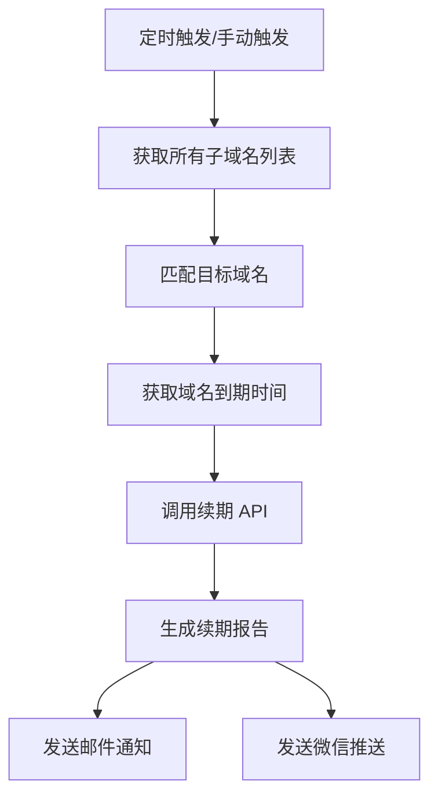

# Domain Keeper - DNSHE 域名自动续期工具

[](https://github.com/features/actions)
[](https://www.python.org/)
[](LICENSE)

一个基于 GitHub Actions 的 DNSHE 域名自动续期工具，支持邮件和微信推送续期报告。

## ✨ 功能特性

- 🔄 **自动续期** - 每日自动检查并续期域名
- 📧 **邮件通知** - 详细的续期报告发送到邮箱
- 📱 **微信推送** - 支持 WxPusher 微信推送通知
- 📊 **详细报告** - 包含统计信息、到期时间、紧急程度标识
- 🔒 **安全存储** - 使用 GitHub Secrets 安全存储敏感信息
- 🎯 **智能匹配** - 自动匹配域名并获取 ID
- 📈 **到期时间** - 显示域名到期时间和剩余天数
- 🚀 **易于部署** - 一键配置，自动运行

## 📋 目录

- [快速开始](#快速开始)
- [配置说明](#配置说明)
- [功能详解](#功能详解)
- [项目结构](#项目结构)
- [常见问题](#常见问题)
- [贡献指南](#贡献指南)
- [赞助支持](#赞助支持)
- [许可证](#许可证)

## 🚀 快速开始

### 前置要求

- GitHub 账号
- DNSHE 域名服务商账号
- SMTP 邮箱服务（可选）
- WxPusher 账号（可选，用于微信推送）

### 部署步骤

1. **Fork 本仓库**
   ```bash
   点击右上角 Fork 按钮
   ```

2. **配置 GitHub Secrets**
   
   进入你 Fork 的仓库 → Settings → Secrets and variables → Actions → New repository secret

   添加以下 Secrets：

   | Secret 名称 | 说明 | 示例 |
   |------------|------|------|
   | `DOMAIN_NAMES` | 要续期的域名列表（逗号分隔） | `example1.com,example2.com` |
   | `API_KEY` | DNSHE API Key | `cfsd_xxxxxxxxxx` |
   | `API_SECRET` | DNSHE API Secret | `yyyyyyyyyyyy` |
   | `EMAIL_TO` | 接收报告的邮箱 | `your@email.com` |
   | `SMTP_SERVER` | SMTP 服务器地址 | `smtp.gmail.com` |
   | `SMTP_PORT` | SMTP 端口 | `465` |
   | `SMTP_USER` | 发件人邮箱 | `your@email.com` |
   | `SMTP_PASSWORD` | 邮箱授权码 | `your-app-password` |
   | `WXPUSHER_APP_TOKEN` | WxPusher 应用 Token（可选） | `AT_xxxxx` |
   | `WXPUSHER_UIDS` | WxPusher 用户 UID（可选） | `UID_xxxxx` |
   | `WXPUSHER_URL` | WxPusher API 地址（可选） | `http://wxpusher.zjiecode.com/api/send/message` |

3. **启用 GitHub Actions**
   
   进入 Actions 标签页，点击 "I understand my workflows, go ahead and enable them"

4. **手动触发测试**
   
   Actions → Domain Auto Renewal → Run workflow → Run workflow

### 获取 DNSHE API 凭证

1. 登录 [DNSHE 域名管理页面](https://www.dnshe.com)
2. 进入 API 管理页面
3. 创建新的 API Key 和 Secret
4. 复制并保存到 GitHub Secrets

## ⚙️ 配置说明

### 必需配置

```yaml
# 域名列表
DOMAIN_NAMES=example1.com,example2.com,example3.com

# DNSHE API 凭证
API_KEY=cfsd_xxxxxxxxxx
API_SECRET=yyyyyyyyyyyy
```

### 邮件通知配置

```yaml
# 邮件接收配置
EMAIL_TO=your@email.com

# SMTP 发送配置
SMTP_SERVER=smtp.gmail.com
SMTP_PORT=465
SMTP_USER=your@email.com
SMTP_PASSWORD=your-app-password
```

**常用 SMTP 配置：**

| 邮箱服务 | SMTP 服务器 | 端口 |
|---------|------------|------|
| Gmail | smtp.gmail.com | 465 |
| Outlook | smtp-mail.outlook.com | 587 |
| QQ 邮箱 | smtp.qq.com | 465 |
| 163 邮箱 | smtp.163.com | 465 |

### 微信推送配置（可选）

```yaml
# WxPusher 配置
WXPUSHER_APP_TOKEN=AT_xxxxx
WXPUSHER_UIDS=UID_xxxxx
WXPUSHER_URL=http://wxpusher.zjiecode.com/api/send/message
```

**获取 WxPusher 凭证：**

1. 关注 WxPusher 微信公众号
2. 创建应用获取 APP_TOKEN
3. 获取用户 UID

## 📊 功能详解

### 自动续期流程



### 续期报告示例

```
╔════════════════════════════════════════════════════════════════════╗
║                        域名自动续期报告                              ║
╠════════════════════════════════════════════════════════════════════╣
║ 报告时间: 2026-05-06 10:30:00                                        ║
║ 总域名数: 6                                                          ║
║ 成功续期: 4                                                          ║
║ 失败续期: 2                                                          ║
║ 成功率:   66.7%                                                      ║
╚════════════════════════════════════════════════════════════════════╝

✅ 成功续期的域名:
──────────────────────────────────────────────────────────────────────
  🌐 域名: example1.com
     ID: 12345
     原到期时间: 2026-05-10
     新到期时间: 2027-05-10
     剩余天数: 365 天
     续期费用: $0.00

❌ 失败续期的域名:
──────────────────────────────────────────────────────────────────────
  🌐 域名: example2.com
     ID: N/A
     错误: 未找到域名

📌 提示:
  • 绿色 🟢: 剩余天数 > 30 天，状态良好
  • 黄色 🟡: 剩余天数 7-30 天，需要关注
  • 红色 🔴: 剩余天数 < 7 天，需要紧急处理
```

### 定时任务

- **执行时间**: 每天 UTC 21:00（北京时间 05:00）
- **执行频率**: 每日一次
- **手动触发**: 支持，可在 Actions 页面手动运行

## 📁 项目结构

```
domain_keeper/
├── .github/
│   └── workflows/
│       └── main.yml          # GitHub Actions 工作流配置
├── scripts/
│   ├── renew_domain.py       # 主程序：域名续期和报告生成
├── .env.example              # 环境变量示例文件
├── .gitignore                # Git 忽略文件配置
├── requirements.txt          # Python 依赖列表
└── README.md                 # 项目说明文档
```

### 核心文件说明

**scripts/renew_domain.py** - 主程序
- 获取所有子域名列表
- 匹配目标域名并获取 ID
- 调用 API 进行续期
- 生成详细的续期报告
- 发送邮件和微信通知

**.github/workflows/main.yml** - 工作流配置
- 定时任务调度
- 环境变量配置
- Python 环境设置
- 依赖安装

## 🔧 高级配置

### 修改执行时间

编辑 `.github/workflows/main.yml` 文件：

```yaml
on:
  schedule:
    - cron: '0 21 * * *'  # 修改 cron 表达式
```

Cron 表达式说明：`分 时 日 月 周`

### 自定义续期逻辑

可以修改 `scripts/renew_domain.py` 中的续期逻辑：

- 修改续期条件（如剩余天数阈值）
- 添加自定义通知方式
- 集成其他域名服务商 API

## ❓ 常见问题

### Q: 为什么域名未找到？

**A:** 可能的原因：
1. 域名名称不匹配 - 检查 `DOMAIN_NAMES` 配置
2. 域名已被删除 - 确认域名是否仍然存在
3. API 权限不足 - 检查 API Key 权限

**解决方法：**
查看 GitHub Actions 日志中的 `--- Available Subdomains from API ---` 部分，对比目标域名和实际域名。

### Q: 邮件发送失败怎么办？

**A:** 检查以下配置：
1. SMTP 服务器地址和端口是否正确
2. 是否使用了邮箱授权码而非登录密码
3. 邮箱是否开启了 SMTP 服务
4. 防火墙是否阻止了 SMTP 连接

### Q: 如何添加多个微信推送用户？

**A:** 在 `WXPUSHER_UIDS` 中用逗号分隔多个 UID：
```
WXPUSHER_UIDS=UID_xxxxx,UID_yyyyy,UID_zzzzz
```

### Q: Node.js 版本警告如何解决？

**A:** 项目已配置 `FORCE_JAVASCRIPT_ACTIONS_TO_NODE24=true`，自动使用 Node.js 24。

### Q: 如何查看 API 返回的数据结构？

**A:** 查看 GitHub Actions 日志中的调试输出：
- `--- API Response Debug ---` - API 响应结构
- `--- Renewal Response Debug ---` - 续期响应结构

## 🤝 贡献指南

欢迎贡献代码、报告问题或提出建议！

### 贡献方式

1. Fork 本仓库
2. 创建特性分支 (`git checkout -b feature/AmazingFeature`)
3. 提交更改 (`git commit -m 'Add some AmazingFeature'`)
4. 推送到分支 (`git push origin feature/AmazingFeature`)
5. 创建 Pull Request

### 开发指南

1. 克隆仓库
   ```bash
   git clone https://github.com/your-username/domain_keeper.git
   cd domain_keeper
   ```

2. 安装依赖
   ```bash
   pip install -r requirements.txt
   ```

3. 配置环境变量
   ```bash
   cp .env.example .env
   # 编辑 .env 文件填入实际值
   ```

4. 本地测试
   ```bash
   python scripts/renew_domain.py
   ```

### 代码规范

- 使用 Python 3.11+ 特性
- 遵循 PEP 8 代码风格
- 添加必要的注释和文档
- 编写清晰的提交信息

## 📝 更新日志

### v1.3.0 (2026-05-06)
- ✨ 添加域名到期时间获取和显示
- 🔍 添加 API 响应数据结构调试
- 📊 增强续期报告详细信息

### v1.2.0 (2026-05-06)
- 📱 添加 WxPusher 微信推送功能
- 🎨 美化续期报告格式
- 📈 添加统计信息和紧急程度标识

### v1.1.0 (2026-05-06)
- 🔧 修复 GitHub Actions Node.js 版本警告
- 🔍 添加域名查找调试信息
- 📝 完善错误提示

### v1.0.0 (2026-05-02)
- 🎉 初始版本发布
- 🔄 实现自动续期功能
- 📧 支持邮件通知

## 📄 许可证

本项目采用 MIT 许可证 - 详见 [LICENSE](LICENSE) 文件

## ☕ 赞助支持

如果这个项目对你有帮助，欢迎赞助支持开发者！

### 💝 赞助方式

- [查看赞助详情](DONATE.md) - 微信/支付宝收款码
- [GitHub Sponsors](https://github.com/sponsors) - GitHub 官方赞助平台

### 🎯 赞助用途

你的赞助将用于：
- ☁️ 域名续期费用
- 🖥️ 服务器维护成本
- ⏰ 开发时间投入

### 🙏 其他支持方式

如果无法赞助，你也可以：
- ⭐ 给项目点个 Star
- 🐛 报告 Bug 或提出建议
- 📖 完善文档
- 💻 贡献代码

## 🙏 致谢

- [DNSHE](https://www.dnshe.com) - 提供域名服务和 API
- [GitHub Actions](https://github.com/features/actions) - 提供自动化平台
- [WxPusher](https://wxpusher.zjiecode.com) - 提供微信推送服务

## 📮 联系方式

- 项目主页: [https://github.com/ActonMartin/domain_keeper](https://github.com/ActonMartin/domain_keeper)
- 问题反馈: [Issues](https://github.com/ActonMartin/domain_keeper/issues)

---

⭐ 如果这个项目对你有帮助，请给一个 Star 支持一下！
